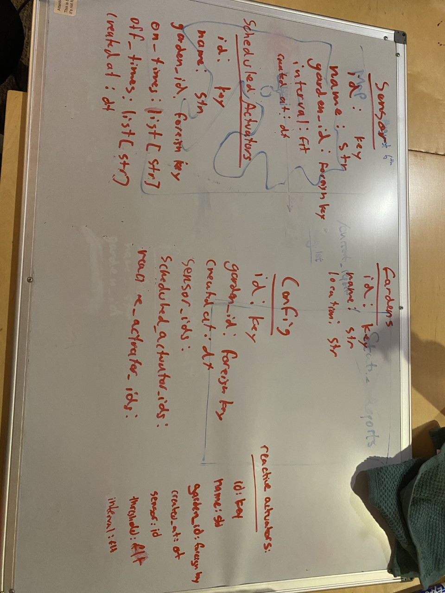
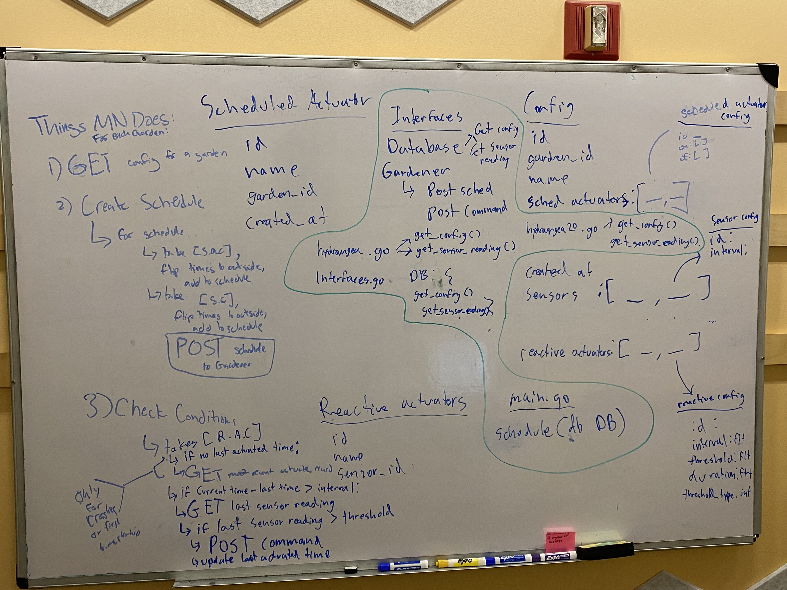

# Hydro Automation Collaboration

This semester I worked on the second revision of Hydro's Automation Architecture. I worked mainly with 1 peer collaborator and a group of ~5 first years/sophomores on this development. Working in a group of this size required deliberate processes to encourage productive collaboration; below are the processes and resources created to facilitate this.

## Team Values

We created a document that contained the values we hope to embody in the team. The values and their description can be found [here](https://docs.google.com/document/d/1-OJNvd0kenk9DHmTYejzCaRjYyAjlhd418WMiSivKus/edit). We presented these values to the team and accepted any feedback or changes that members wanted to add.

We also gave a presentation to the entire PiNT organization to explain how Hydro thinks about their impact as an organization. This was intended to help give each team member agency and motivation to explore their interests freely. This presentation can be found [here](https://docs.google.com/presentation/d/1-0RsYcsTI9V0iFOwBBgDNXiJhX1RRLCftFCTicgvpvw/edit?usp=sharing). 

## Facilitating Knowledge Transfer

We had varying levels of intitutional knowledge and programming experience, so a large part of learning to collaborate was figuring out how to make sure everyone on the team was still learning and contributing. We tried to outline any major design desicions as a group and break them down into concrete iterable steps. Due to the subteam structure, meetings notes were relativeley brief.

Example notes from meeting:

I gave tutorials on Github, Python, Virtual Environemnts, API's and Databases to some of the newer members. 

In the first half of the semester we got a bit developement-crazy in order to expose new programmers to the concepts, overall control flow, and syntax. These were helpful learning exercises, but we neglected to do testing on all of the new components. Once people started understanding how things worked, we decided to restart developement and slowly reintegrate components only if they pass expected behavior through unit tests. [Here](https://github.com/Olin-Hydro/hydrangea/commit/241e65aa7dfa7c46460a29289b85771593d4152b) is an example of collaboration and guidance from the developement-crazy phase; we were able to teach a person who was practically new to programming about API schemas and routing to the point where we could assign a new appropriately scope task that they could complete on their own.

## Code Review

We set up our Data API and Mother Nature repositories to require reviews before merging into main.

Example of reviews for my code:
- https://github.com/Olin-Hydro/hydrangea/pull/16
  
Example of my code reviews:
 - https://github.com/Olin-Hydro/mother-nature/pull/4

Code review allowed our team to stay up to date on the progress in each project as well as get valuable feedback. I personally tried to implement some of the ideas from class, specifically 1) Not phrasing feedback and corrections as things the programmer is at fault for, 2) Trying not to be repetetive but still highlight high-level details and 3) Allowing approval / merges even if code isn't 100% perfect as a means of recognizing progress.

## Conclusion
The above work demonstrates my ability to document team values, facilitate knowledge transfer and review code.