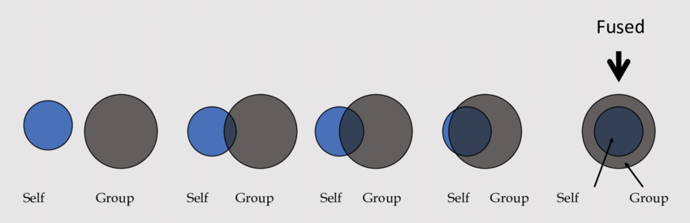

# Team Training vs. Team Bonding for Team Cohesion

## Introduction
In this study, we want to understand the use cases of Team Trainings vs Team bonding exercises in regards to group cohesion, coworking, communication, and interpersonal relationships.

## Defining Team Bonding and Team Training
Team trainings and Team Bondings are both subset of a type of activety called <b>Team Developement Interventions</b>[1].
Our working definitions for both TDI’s are actions/activities taken to alter the cohesion of organized teams. However, what differentiates them in our eyes is the focus on work and performance during these actions/activities. We define TT’s as actions taken to alter the performance trajectories of organizational teams, while team bonding activities are not performance based/oriented. 

## Where the research is now
There are many more types of activities under the blanket of TDI's, including Team Teak Analysis (TTA), Team Compostition Assessments (TCo), and Team Performance and Monitoring Assessments (TP&M).  We will focus on Team Training, which is defined as a “set of theoretically based strategies or instructional processes, which are based on the science and practice of designing and delivering instruction to enhance and maintain team performance under different conditions”[2]. The purpose of TT is for team members to understand, practice, and obtain the knowledge, skills, and abilities required for effective performance. The goal is to explicitly identify teamwork deficiencies and learn skills to address these deficiencies. We chose this category of TDI because of its direct focus on teamwork in relation to performance. A example of a TT TDI would be a guided team self-correction, a team debriefing strategy in which members are given the responsibility for diagnosing and solving their team’s performance problems with guidance as to what topics they should discuss and how to do so constructively. Team could, for instance, be trained on feedback skills and and specific instructions to discuss task expectations during team debriefs. This guidance is supposed to greater develope shared task expectations and demonstrated more efficient teamwork processes through the lense of performance[3]. Another example of a TT would be a crew resource management (CRM training), a type of training that trains members on teamwork skills and better utilization of the skills, tools, and people involved in the job. CRM’s are successfully used in lots of industries like aviation[4]. 

Team Bonding, on the other hand, does not directly focus on performance and the work that is being done. With Team Bonding exercises, the goal is generally to improve interpersonal relations and social interactions through the goal of accomplishing non-work related task. Team bonding activities can come in many forms, but a good team bonding activity typically involves goal setting, interpersonal relations, role clarification, or problem-solving[5] through group collaboration on this external task. An example of a team bonding activity would be a group outdoor challenge where team must be self-sufficient, camp on the moor overnight, and complete a long distance hike over the course of two days[6]. Another example of a TB would be a straw tower team-building exercise. In this exercise, teams are provided a limited amount of supplies (tape and straws) and instructed to construct a straw tower in 15 minutes with the goal of constructing the tallest tower of all teams. At the end of 15 minutes, the team with the tallest tower standing is recognized as the winning team[8].

Team Bonding as we have defined is actually more formally categorized within TDI’s as Team Building. We are choosing to more strictly constrict TB’s and directly compare their performance in terms of teamwork. (The paper that categorizes them mainly focuses on trends around volume of literature on each type of TDI and the need for an overarching framework that encompasses all types of TDI’s in order to learn what generally is effective.) 

## Experiment
To delve into our insight, we will conduct testing over a two year period with check-ins every month, with 24 teams averaging 10 members per team per trial. We will be conducting testing in 12 companies for each category of activity (TT and TB) and further experiment with company size: 4 large software companies, 4 mid-size software companies, and 4 small start-ups for each type of activity. We will ask each company to perform some regularly scheduled team bonding or team training activity around every 2 months. Meanwhile, the team bonding activity groups could either do a group outdoor team challenge or classroom exercise if an outdoor team challenge isn’t feasible. We will cover the cost of any coaching/training/classroom activity/outdoor challenge, and potentially cover the cost of time off.

## Metrics & Data Collection
We tried to choose both qualitative and quantitative data points to measure the effectiveness of various team building and bonding methods. Qualitatively, we will use mixed-method surveys to see how participants feel about the effectiveness of the activities, whether they feel they are able to better work with their team afterwards. 

Within the surveys, we will use several open ended and close ended items.
- Open Ended
  - Did this serve as an oppurtunity for your team to work together towards a common goal?
  - Did this serve as an opportunity for your team to cognitively evaluate charactersists of teammates and team dynamics ((personalities, workstyles, interpersonal dynamics, strengths, weaknesses, appropriate roles).
  - Did this help to develope communication skills?
  - Did this facilitate building closer interpersonal relationships?
  - Was today’s activity a positive experience for you?
- Close Ended
  - Did today’s activity help you get to know your team better?
  - Did today's team activity help in gaining team momentum?
  - Did today's activity make me feel more confident that our group will work together well?
  - How committed do you feel to the other members of your team?
  - When someone criticizes our work team, does it seem like a personal insult?
  - To who/how often do you often turn for advice in work-related matters?

As part of the survey we will also ask emembers of the team to place themselves on a Pictorial Fusion Scale.[8]

We will also have peer reviews that would show whether members were more or less engaged overall during meetings by the number of times they spoke up, and how well they were able to retain information about the meeting afterwards. We could measure amount of time spent collaborating with others.

## Validity and Cofounding Variables
We have learned a lot of dummy variables the experiment could be uncontrolled, like a team having pre-disposed relationships, team tenure, task at hand, organizational structure, a team just working better, teams that already do some sort of bonding or training, wether people actually want to do team bonding/training, when the team bonding itself happens, a person having bias in their responses to questions.

To evaluate the validity of our overall study, we want to ensure that we are testing as broad a group as possible, which is why we are looking at multiple teams in many companies, and looking at companies of differing sizes since teaming dynamics will change as a company is bigger or smaller. To test the validity of our data collection methods, we will try to minimize our personal biases by having multiple kinds of data collection, some of which will involve us directly interacting with teams and some that will not. There is no way to account for all biases, but we hope that by having a large number of teams being tested, we will get enough varying data points that we will still be able to see trends.

A smaller-scale pilot study to get a sense of the validity of the experiment should also be done to better understand what works/doesn’t work.

## References
[1]
Shuffler ML, Diazgranados D, Maynard MT, Salas E. DEVELOPING, SUSTAINING, AND MAXIMIZING TEAM EFFECTIVENESS: AN INTEGRATIVE, DYNAMIC PERSPECTIVE OF TEAM DEVELOPMENT INTERVENTIONS. Acad Manag Ann. 2018 Jun;12(2):688-724. doi: 10.5465/annals.2016.0045. Epub 2018 Jul 9. PMID: 30931078; PMCID: PMC6438631.

[2]Cannon-Bowers, Janis A., and Eduardo Salas. “Team Performance and Training in Complex Environments: Recent Findings from Applied Research.” Current Directions in Psychological Science, vol. 7, no. 3, 1998, pp. 83–87. JSTOR, http://www.jstor.org/stable/20182510. Accessed 7 Dec. 2022.

[3]Smith-Jentsch, Kimberly & Cannon-Bowers, Janis & Tannenbaum, Scott & Salas, Eduardo. (2008). Guided team self-correction: Impacts on team mental models, behavior, and effectiveness.. Small Group Research. 30. 303-327. 

[4]Salas E, Burke CS, Bowers CA, Wilson KA. Team training in the skies: does crew resource management (CRM) training work? Hum Factors. 2001 Winter;43(4):641-74. doi: 10.1518/001872001775870386. PMID: 12002012.

[5]Stanton, Neville, et al. Handbook of Human Factors and Ergonomics Methods. CRC Press - Taylor &amp; Francis Group, 2019.

[6] Cohen, Emma & Davis, Arran & Taylor, Jacob. (2022). Interdependence, bonding and support are associated with improved mental wellbeing following an outdoor team challenge. Applied Psychology: Health and Well-Being. 10.1111/aphw.12351.

[7]Gresch, E., Saunders, M., &amp; Rawls, J. (2020). Are We Bonding Yet? Using a Mixed Methods Survey Design to Evaluate Team-building Exercise Outcomes. Business Education Innovation Journal, 12(1), 83–91. 

[8]Whitehouse, Harvey & Fitzgerald, Robin. (2020). Fusion and Reform. Anthropology in Action. 27. 1-13. 10.3167/aia.2020.270101. 

